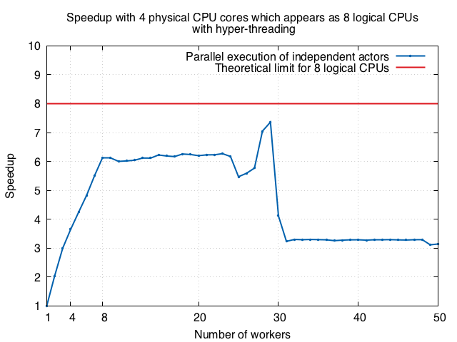

## Motivation

This code aims at illustrating/experimenting [Amdahl's law](https://en.wikipedia.org/wiki/Amdahl%27s_law) within the JVM.
We aim at showing that increasing the number of workers/threads/actors increases the number of CPUs employed until a limit.

The following experiments have been performed on a MacBook Pro 2,8 GHz Intel Core i7 Quad-core. 
The 4 physical cores appears as 8 logical CPUs with hyper-threading.

"In theory, there is no difference between theory and practice. But, in practice, there is."  Johannes Lambertus Adriana van de Snepscheut. 

## Use case

The value of PI can be calculated approximately using the following method of approximating PI:

1. Inscribe a circle in a square

2. Generate randomly points in the square

3. Determine the number of points in the square that are also in the circle. Then, PI ~ 4 * number of points in the square. Note that the more points generated, the better the approximation is.

This computation is easy to parallelize since:

- all point generations are independent; 

- there is no need for data shared and synchronization.

In order to parallelize the computation, the loop is divided into equal portions that can be executed by a pool of workers.
Each worker performs independently its computation. The supervisor collects the results and computes the value of PI. 

## Implementation

In order to evaluate the speedup with respect to the number of workers within the Java Virtual Machine we have adopted:

- the programming language Scala. Alternatively, you can select Java. 
  Anyway, the code is compiled to Java bytecode. So the resulting executable code runs on a JVM. 

- the paradigm of asynchronous message-passing concurrency, i.e. the Actor model. For this purpose, we employ the open-source toolkit [Akka](http://akka.io/). Alternatively, you can select [shared-state concurrency](https://docs.oracle.com/javase/tutorial/essential/concurrency/) such as Threads or Thread Pools.

## Requirements

In order to run the demonstration you need: the Java virtual machine [JVM 1.8.0_60](http://www.oracle.com/technetwork/java/javase/downloads/index.html).

In order to compile the code you need:
- the programming language [Scala 2.11.8](http://www.scala-lang.org/download/);
- the interactive build tool [SBT 0.13](http://www.scala-sbt.org/download.html).

## Tests

    sbt run

or 

    java -jar ./AmdhalDemonstration-assembly-0.1.jar

The programm prints a CSV file nbwWorkers,speedup.

## Installation

    sbt compile

and eventually 

    sbt assembly

## Contributors

Copyright (C) Dialectics 2016

## License

This program is free software: you can redistribute it and/or modify it under the terms of the 
GNU General Public License as published by the Free Software Foundation, either version 3 of the License, 
or (at your option) any later version.

This program is distributed in the hope that it will be useful, but WITHOUT ANY WARRANTY; 
without even the implied warranty of MERCHANTABILITY or FITNESS FOR A PARTICULAR PURPOSE.  
See the GNU General Public License for more details.

You should have received a copy of the GNU General Public License along with this program.  
If not, see <http://www.gnu.org/licenses/>.